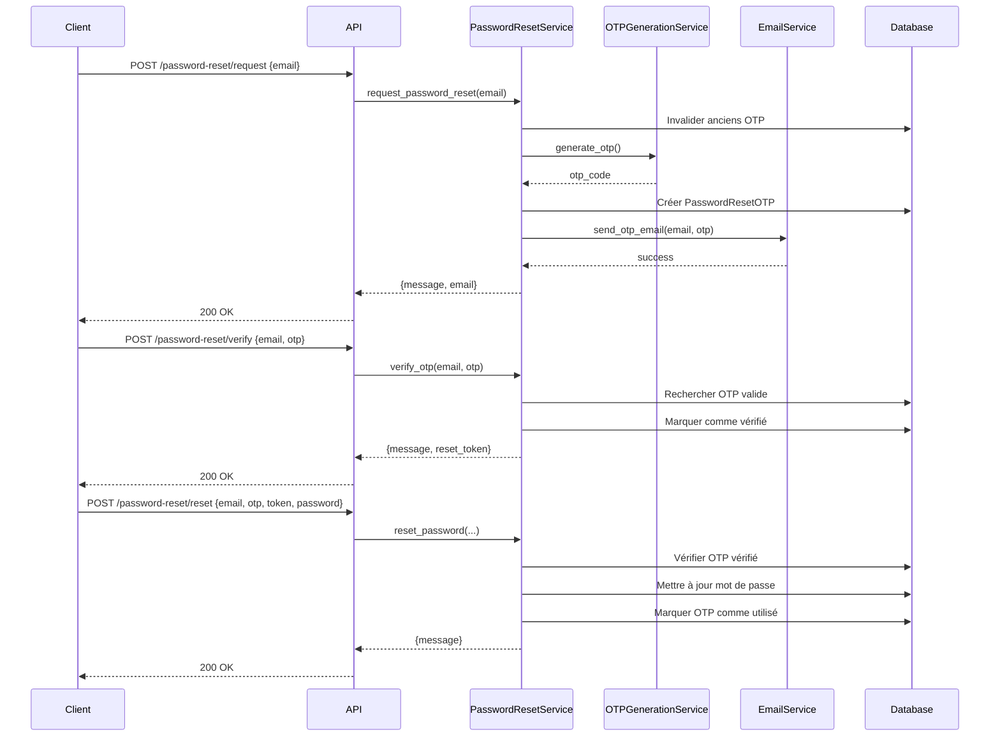

# Design Document - Password Reset OTP

## Overview

Ce document décrit la conception technique du système de réinitialisation de mot de passe par OTP pour rhBackFast. Le système sera implémenté en suivant l'architecture FastAPI existante avec SQLAlchemy async, en respectant le pattern de découpage en services utilisé dans conge_app.

Le système permettra aux utilisateurs de réinitialiser leur mot de passe de manière sécurisée via un processus en 3 étapes:
1. Demande d'OTP (envoi par email)
2. Vérification de l'OTP
3. Réinitialisation du mot de passe

## Architecture

### Structure des dossiers

```
app/
└── reset_password_app/
    ├── __init__.py
    ├── models.py           # Modèle SQLAlchemy PasswordResetOTP
    ├── schemas.py          # Schémas Pydantic pour validation
    ├── routes.py           # Endpoints FastAPI
    ├── services/
    │   ├── __init__.py
    │   ├── otp_generation_service.py    # Génération d'OTP
    │   ├── email_service.py             # Envoi d'emails
    │   ├── otp_validation_service.py    # Validation d'OTP
    │   └── password_reset_service.py    # Orchestration du processus
    └── templates/
        └── otp_email.html  # Template HTML pour l'email
```

### Flux de données



## Components and Interfaces

### 1. Modèle de données (models.py)

```python
class PasswordResetOTP(Base):
    """Modèle pour stocker les OTP de réinitialisation de mot de passe"""
    __tablename__ = "password_reset_otp"

    id: Mapped[int] = mapped_column(Integer, primary_key=True, index=True)
    user_id: Mapped[int] = mapped_column(
        ForeignKey("user_management_user.id", ondelete="CASCADE")
    )
    email: Mapped[str] = mapped_column(String(255), index=True)
    otp: Mapped[str] = mapped_column(String(6))
    reset_token: Mapped[str] = mapped_column(String(100), unique=True, index=True)
  is_verified: Mapped[bool] = mapped_column(Boolean, default=False)
    is_used: Mapped[bool] = mapped_column(Boolean, default=False)
    created_at: Mapped[datetime] = mapped_column(DateTime, default=datetime.utcnow)
    verified_at: Mapped[Optional[datetime]] = mapped_column(DateTime, nullable=True)
    expires_at: Mapped[datetime] = mapped_column(DateTime)

    # Relationship
    user: Mapped["User"] = relationship("User", foreign_keys=[user_id])

    def is_expired(self) -> bool:
        """Vérifie si l'OTP est expiré"""
        return datetime.utcnow() > self.expires_at
```

### 2. Schémas Pydantic (schemas.py)

```python
class ForgotPasswordRequest(BaseModel):
    """Schéma pour la demande de réinitialisation"""
    email: EmailStr

class ForgotPasswordResponse(BaseModel):
    """Réponse après demande d'OTP"""
    message: str
    email: str

class VerifyOTPRequest(BaseModel):
    """Schéma pour la vérification d'OTP"""
    email: EmailStr
    otp: str = Field(..., min_length=6, max_length=6, pattern=r'^\d{6}$')

class VerifyOTPResponse(BaseModel):
    """Réponse après vérification d'OTP"""
    message: str
    reset_token: str

class ResendOTPRequest(BaseModel):
    """Schéma pour le renvoi d'OTP"""
    email: EmailStr

class ResendOTPResponse(BaseModel):
    """Réponse après renvoi d'OTP"""
    message: str

class ResetPasswordRequest(BaseModel):
    """Schéma pour la réinitialisation du mot de passe"""
    email: EmailStr
    otp: str = Field(..., min_length=6, max_length=6, pattern=r'^\d{6}$')
    reset_token: str
    password: str = Field(..., min_length=8)

    @validator('password')
    def validate_password_strength(cls, v):
        """Valide la force du mot de passe"""
        if not re.search(r'[A-Za-z]', v):
            raise ValueError("Le mot de passe doit contenir au moins une lettre")
        if not re.search(r'\d', v):
            raise ValueError("Le mot de passe doit contenir au moins un chiffre")
        return v

class ResetPasswordResponse(BaseModel):
    """Réponse après réinitialisation"""
    message: str
```

### 3. Service de génération d'OTP (otp_generation_service.py)

```python
class OTPGenerationService:
    """Service pour générer des codes OTP"""

    @staticmethod
    def generate_otp() -> str:
        """Génère un code OTP de 6 chiffres"""
        return ''.join(random.choices(string.digits, k=6))

    @staticmethod
    def generate_reset_token() -> str:
        """Génère un token de réinitialisation sécurisé"""
        return secrets.token_urlsafe(32)

    @staticmethod
    def calculate_expiry() -> datetime:
        """Calcule la date d'expiration (15 minutes)"""
        return datetime.utcnow() + timedelta(minutes=15)
```

### 4. Service d'email (email_service.py)

```python
class EmailService:
    """Service pour l'envoi d'emails"""

    def __init__(self):
        self.smtp_host = settings.SMTP_HOST
        self.smtp_port = settings.SMTP_PORT
        self.smtp_user = settings.SMTP_USER
        self.smtp_password = settings.SMTP_PASSWORD
        self.from_email = settings.SMTP_FROM_EMAIL
        self.smtp_tls = settings.SMTP_TLS

    async def send_otp_email(
        self,
        email: str,
        otp: str,
        user_name: Optional[str] = None
    ) -> bool:
        """Envoie un email contenant l'OTP"""
        try:
            subject = "Code de vérification - Réinitialisation mot de passe"

            # Charger le template HTML
            html_content = self._render_otp_template(otp, user_name)
            plain_content = self._render_plain_text(otp, user_name)

            # Créer le message
            message = MIMEMultipart("alternative")
            message["Subject"] = subject
            message["From"] = self.from_email
            message["To"] = email

            # Attacher les versions texte et HTML
            part1 = MIMEText(plain_content, "plain")
            part2 = MIMEText(html_content, "html")
            message.attach(part1)
            message.attach(part2)

            # Envoyer l'email
            with smtplib.SMTP(self.smtp_host, self.smtp_port) as server:
                if self.smtp_tls:
                    server.starttls()
                server.login(self.smtp_user, self.smtp_password)
                server.send_message(message)

            return True
        except Exception as e:
            logger.error(f"Erreur lors de l'envoi de l'email: {e}")
            return False

    def _render_otp_template(self, otp: str, user_name: Optional[str]) -> str:
        """Génère le contenu HTML de l'email"""
        # Template HTML avec le code OTP
        pass

    def _render_plain_text(self, otp: str, user_name: Optional[str]) -> str:
        """Génère la version texte de l'email"""
        pass
```

### 5. Service de validation d'OTP (otp_validation_service.py)

```python
class OTPValidationService:
    """Service pour valider les OTP"""

    def __init__(self, db: AsyncSession):
        self.db = db

    async def find_valid_otp(
        self,
        email: str,
        otp: str,
        require_verified: bool = False
    ) -> Optional[PasswordResetOTP]:
        """Recherche un OTP valide"""
        query = select(PasswordResetOTP).where(
            PasswordResetOTP.email == email,
            PasswordResetOTP.otp == otp,
            PasswordResetOTP.is_used == False
        )

        if require_verified:
            query = query.where(PasswordResetOTP.is_verified == True)
        else:
            query = query.where(PasswordResetOTP.is_verified == False)

        result = await self.db.execute(query)
        return result.scalar_one_or_none()

    async def invalidate_user_otps(self, user_id: int) -> None:
        """Invalide tous les OTP non utilisés d'un utilisateur"""
        await self.db.execute(
            update(PasswordResetOTP)
            .where(
                PasswordResetOTP.user_id == user_id,
                PasswordResetOTP.is_used == False
            )
            .values(is_used=True)
        )
        await self.db.commit()

    async def check_recent_otp(self, user_id: int, minutes: int = 1) -> bool:
        """Vérifie si un OTP récent existe"""
        threshold = datetime.utcnow() - timedelta(minutes=minutes)
        query = select(PasswordResetOTP).where(
            PasswordResetOTP.user_id == user_id,
            PasswordResetOTP.created_at >= threshold
        )
        result = await self.db.execute(query)
        return result.scalar_one_or_none() is notNone
```

### 6. Service de réinitialisation de mot de passe (password_reset_service.py)

```python
class PasswordResetService:
    """Service principal pour orchestrer le processus de réinitialisation"""

    def __init__(self, db: AsyncSession):
        self.db = db
        self.otp_gen = OTPGenerationService()
        self.email_service = EmailService()
        self.otp_validation = OTPValidationService(db)

    async def request_password_reset(self, email: str) -> Dict[str, Any]:
        """Étape 1: Demande de réinitialisation"""
        # Rechercher l'utilisateur
    user = await self._find_user_by_email(email)
        if not user:
            raise ValueError("Aucun compte associé à cette adresse email")

        # Invalider les anciens OTP
        await self.otp_validation.invalidate_user_otps(user.id)

        # Générer un nouveau OTP
        otp_code = self.otp_gen.generate_otp()
        reset_token = self.otp_gen.generate_reset_token()
        expires_at = self.otp_gen.calculate_expiry()

        # Créer l'enregistrement
        otp_record = PasswordResetOTP(
            user_id=user.id,
            email=email,
            otp=otp_code,
            reset_token=reset_token,
            expires_at=expires_at
        )
        self.db.add(otp_record)
        await self.db.commit()

        # Envoyer l'email
        user_name = f"{user.nom} {user.prenom}".strip()
        email_sent = await self.email_service.send_otp_email(
            email, otp_code, user_name
        )

        if not email_sent:
            await self.db.delete(otp_record)
            await self.db.commit()
            raise RuntimeError("Erreur lors de l'envoi de l'email")

        return {"message": "Code OTP envoyé avec succès", "email": email}

    async def verify_otp(self, email: str, otp: str) -> Dict[str, Any]:
        """Étape 2: Vérification de l'OTP"""
        # Rechercher l'utilisateur
        user = await self._find_user_by_email(email)
        if not user:
            raise ValueError("Aucun compte associé à cette adresse email")

        # Rechercher l'OTP
        otp_record = await self.otp_validation.find_valid_otp(

 otp_record.is_expired():
            raise ValueError("Code OTP expiré. Veuillez demander un nouveau code.")

        # Marquer comme vérifié
        otp_record.is_verified = True
        otp_record.verified_at = datetime.utcnow()
        await self.db.commit()

        return {
            "message": "Code OTP vérifié avec succès",
            "reset_token": otp_record.reset_token
        }

    async def resend_otp(self, email: str) ->
Dict[str, Any]:
        """Renvoi d'un OTP"""
        # Rechercher l'utilisateur
        user = await self._find_user_by_email(email)
       if not user:
            raise ValueError("Aucun compte associé à cette adresse email")

        # Vérifier la limite de temps
        has_recent = await self.otp_validation.check_recent_otp(user.id, minutes=1)
        if has_recent:
            raise ValueError(
                "Veuillez attendre 1 minute avant de demander un nouveau code"
            )

        # Utiliser la même logique que request_password_reset
        return await self.request_password_reset(email)

    async def reset_password(
        self,
        email: str
,
        otp: str,
        reset_token: str,
        new_password: str
    ) -> Dict[str, Any]:
        """Étape 3: Réinitialisation du mot de passe"""
        # Rechercher l'utilisateur
        user = await self._find_user_by_email(email)
        if not user:
            raise ValueError("Aucun compte associé à cette adresse email")

        # Rechercher l'OTP vérifié
        otp_record = await self.otp_validation.find_valid_otp(
            email, otp, require_verified=True
        )

        if not otp_record or otp_record.reset_token != reset_token:
            raise ValueE
rror("Token de réinitialisation invalide ou expiré")

        if otp_record.is_expired():
            raise ValueError("Session expirée. Veuillez recommencer le processus.")

        # Mettre à jour le mot de passe dans une transaction
        async with self.db.begin():
            # Hasher le nouveau mot de passe
            from app.core.security import get_password_hash
            user.password = get_password_hash(new_password)

            # Marquer l'OTP comme utilisé
            otp_record.is_used = True

            # Invalider tous les autres OTP
            await self.otp_validation.invalidate_user_otps(user.id)

        return {"message": "Mot de passe réinitialisé avec succès"}

    async def _find_user_by_email(self, email: str) -> Optional[User]:
        """Recherche un utilisateur par email"""
        from app.user_app.models import User
        query = select(User).where(User.email == email)
        result = await self.db.execute(query)
        r
eturn result.scalar_one_or_none()
```

### 7. Routes API (routes.py)

```python
router = APIRouter(prefix="/api/password-reset", tags=["Password Reset"])

@router.post("/request", response_model=ForgotPasswordResponse)
async def request_password_reset(
    request: ForgotPasswordRequest,
    db: AsyncSession = Depends(get_db)
):
    """Demande de réinitialisation de mot de passe"""
    try:
        service = PasswordResetService(db)
        result = await service.request_password_reset(request.email)
        return result
    except ValueError as e:
        raise HTTPException(status_code=400, deta
il=str(e))
    except RuntimeError as e:
        raise HTTPException(status_code=500, detail=str(e))

@router.post("/verify", response_model=VerifyOTPResponse)
async def verify_otp(
    request: VerifyOTPRequest,
    db: AsyncSession = Depends(get_db)
):
    """Vérification du code OTP"""
    try:
        service = PasswordResetService(db)
        result = await service.verify_otp(request.email, request.otp)
        return result
    except ValueError as e:
        raise HTTPException(status_code=400, detail=str(e))

@router.post("/resend", response_model=ResendOTPResponse)
async def resend_otp(
    request: ResendOTPRequ
uest,
    db: AsyncSession = Depends(get_db)
):
    """Réinitialisation du mot de passe"""
    try:
        service = PasswordResetService(db)
        result = await service.reset_password(
            request.email,
            request.otp,
            request.reset_token,
            request.password
        )
        return result
    except ValueError as e:
        raise HTTPException(status_code=400, detail=str(e))
```

## Data Models

### PasswordResetOTP

| Champ | Type | Contraintes | Description |
|-
e |
| user_id | Integer | FK(user_management_user.id), NOT NULL | Référence à l'utilisateur |
| email | String(255) | NOT NULL, Indexed | Email de l'utilisateur |
| otp | String(6) | NOT NULL | Code OTP à 6 chiffres |
| reset_token | String(100) | UNIQUE, NOT NULL, Indexed | Token de réinitialisation |
| is_verified | Boolean | DEFAULT False | OTP vérifié ou non |
| is_used | Boolean | DEFAULT False | OTP utilisé ou non |
| created_at | DateTime | DEFAULT utcnow() | Date de création |
| verified_at | DateTime | NULLABLE | Date de vérification |
| expires_at | DateTime | NOT NULL | Date d'expiration |

### Relations

- `PasswordResetOTP.user_id` → `User.id` (Many-to-One)
- Cascade: ON DELETE CASCADE

## Correctness Properties

*Une propriété est une caractéristique ou un comportement qui doit être vrai pour toutes les exécutions valides d'un système - essentiellement, une déclaration formelle sur ce que le système doit faire. Les propriétés servent de pont entre les spécifications lisibles par l'homme et les garanties de correction vérifiables par machine.*


### Property 1: Email validation rejects non-existent emails
*For any* email address submitted for password reset, the system should only accept emails that exist in the user_management_user table
**Validates: Requirements 1.1**

### Property 2: OTP invalidation clears previous attempts
*For any* user requesting a password reset, all non-used OTP records for that user should be marked as used before creating a new OTP
**Validates: Requirements 1.2, 3.3, 4.12**

### Property 3: OTP format is always 6 digits
*For any* generated OTP code, the code should contain exactly 6 numeric digits
**Validates: Requirements 1.3, 3.4**

### Property 4: Reset tokens are unique
*For any* two PasswordResetOTP records, their reset_token values should be different
**Validates: Requirements 1.4, 3.5**

### Property 5: Expiration time is always 15 minutes
*For any* PasswordResetOTP record created, expires_at should equal created_at plus exactly 15 minutes
**Validates: Requirements 1.5**

### Property 6: Email service is called with correct parameters
*For any* successful OTP creation, the email service should be invoked with the user's email and the generated OTP code
**Validates: Requirements 1.6, 3.6**

### Property 7: OTP format validation rejects invalid codes
*For any* OTP code submitted for verification, codes that are not exactly 6 numeric digits should be rejected
**Validates: Requirements 2.1**

### Property 8: Only non-verified and non-used OTPs are found
*For any* OTP verification request, the system should only find OTP records where is_verified=False and is_used=False
**Validates: Requirements 2.2**

### Property 9: Expiration detection is accurate
*For any* OTP record, is_expired() should return True if and only if current time is greater than expires_at
**Validates: Requirements 2.4, 4.7**

### Property 10: Verification marks OTP as verified
*For any* successful OTP verification, the OTP record should have is_verified=True and verified_at set to the verification timestamp
**Validates: Requirements 2.6, 2.7**

### Property 11: Verification returns reset token
*For any* successful OTP verification, the response should contain the reset_token from the OTP record
**Validates: Requirements 2.8**

### Property 12: Rate limiting prevents rapid requests
*For any* user, if an OTP was created within the last minute, a new resend request should be rejected with HTTP 429
**Validates: Requirements 3.1, 3.2**

### Property 13: Password validation enforces minimum length
*For any* password submitted for reset, passwords with fewer than 8 characters should be rejected
**Validates: Requirements 4.2**

### Property 14: Password validation requires letters
*For any* password submitted for reset, passwords without at least one letter should be rejected
**Validates: Requirements 4.3**

### Property 15: Password validation requires digits
*For any* password submitted for reset, passwords without at least one digit should be rejected
**Validates: Requirements 4.4**

### Property 16: Password reset requires verified OTP
*For any* password reset request, the system should only find OTP records where is_verified=True and is_used=False
**Validates: Requirements 4.5**

### Property 17: Passwords are hashed before storage
*For any* password reset, the password stored in the database should be different from the plaintext password submitted
**Validates: Requirements 4.9**

### Property 18: Password update is atomic
*For any* password reset, either all changes (password update, OTP marking, invalidation) succeed together or all fail together
**Validates: Requirements 4.10**

### Property 19: Successful reset marks OTP as used
*For any* successful password reset, the OTP record should have is_used=True
**Validates: Requirements 4.11**

### Property 20: Email template contains required elements
*For any* OTP email generated, the HTML content should contain the OTP code, expiration time (15 minutes), and security warning
**Validates: Requirements 9.1, 9.3, 9.4, 9.5**

## Error Handling

### Exception Hierarchy

```python
class PasswordResetError(Exception):
    """Base exception for password reset errors"""
    pass

class UserNotFoundError(PasswordResetError):
    """User email not found"""
    pass

class OTPExpiredError(PasswordResetError):
    """OTP has expired"""
    pass

class OTPInvalidError(PasswordResetError):
    """OTP is invalid"""
    pass

class RateLimitError(PasswordResetError):
    """Too many requests"""
    pass

class EmailSendError(PasswordResetError):
    """Failed to send email"""
    pass
```

### Error Responses

| Error Type | HTTP Status | Message (FR) |
|------------|-------------|--------------|
| UserNotFoundError | 400 | "Aucun compte associé à cette adresse email" |
| OTPExpiredError | 400 | "Code OTP expiré. Veuillez demander un nouveau code." |
| OTPInvalidError | 400 | "Code OTP invalide ou expiré" |
| RateLimitError | 429 | "Veuillez attendre 1 minute avant de demander un nouveau code" |
| EmailSendError | 500 | "Erreur lors de l'envoi de l'email. Veuillez réessayer." |
| ValidationError | 400 | Message spécifique de Pydantic |
| Generic Exception | 500 | "Une erreur est survenue. Veuillez réessayer." |

### Logging Strategy

- **INFO**: Demandes de réinitialisation réussies (sans OTP)
- **WARNING**: Tentatives avec OTP invalide, emails non trouvés
- **ERROR**: Échecs d'envoi d'email, erreurs de base de données
- **CRITICAL**: Erreurs de transaction, corruption de données

**Champs sensibles à ne jamais logger**: OTP, reset_token, password

## Testing Strategy

### Dual Testing Approach

Le système sera testé avec deux approches complémentaires:

1. **Tests unitaires**: Valident des exemples spécifiques, cas limites et conditions d'erreur
2. **Tests basés sur les propriétés**: Vérifient les propriétés universelles sur tous les inputs

### Property-Based Testing

**Framework**: Hypothesis (Python)

**Configuration**:
- Minimum 100 itérations par test de propriété
- Chaque test référence sa propriété du document de design
- Format de tag: `# Feature: password-reset-otp, Property N: [property_text]`

**Générateurs personnalisés**:
```python
@st.composite
def valid_email(draw):
    """Génère un email valide existant dans la DB"""
    pass

@st.composite
def otp_code(draw, valid=True):
    """Génère un code OTP (valide ou invalide)"""
    if valid:
        return ''.join(draw(st.lists(st.sampled_from('0123456789'), min_size=6, max_size=6)))
    else:
        return draw(st.text())

@st.composite
def password_string(draw, valid=True):
    """Génère un mot de passe (valide ou invalide)"""
    pass

@st.composite
def otp_record_state(draw):
    """Génère un état d'OTP (vérifié/non vérifié, utilisé/non utilisé, expiré/valide)"""
    pass
```

### Unit Testing Focus

Les tests unitaires se concentreront sur:
- Exemples spécifiques de validation d'email
- Cas limites de format d'OTP (5 chiffres, 7 chiffres, lettres)
- Cas d'erreur d'envoi d'email
- Transactions de base de données
- Intégration des services

### Test Coverage Goals

- **Services**: 90%+ de couverture
- **Routes**: 85%+ de couverture
- **Models**: 80%+ de couverture
- **Schemas**: 95%+ de couverture (validation Pydantic)

## Security Considerations

### Protection contre les attaques

1. **Énumération d'emails**: Messages d'erreur génériques pour éviter de révéler l'existence d'un compte
2. **Brute force OTP**:
   - Expiration courte (15 minutes)
   - Invalidation après utilisation
   - Limitation de débit (1 minute entre les demandes)
3. **Timing attacks**: Utilisation de comparaisons à temps constant pour les tokens
4. **SQL Injection**: Utilisation de SQLAlchemy ORM avec paramètres liés
5. **XSS dans emails**: Échappement HTML dans les templates

### Bonnes pratiques

- Hashage des mots de passe avec bcrypt (via passlib)
- Tokens générés avec `secrets.token_urlsafe()` (cryptographiquement sécurisé)
- Transactions atomiques pour les opérations critiques
- Logs sans données sensibles
- HTTPS obligatoire en production

## Deployment Considerations

### Configuration requise

Variables d'environnement à définir dans `.env`:
```
SMTP_HOST=smtp.gmail.com
SMTP_PORT=587
SMTP_USER=your-email@gmail.com
SMTP_PASSWORD=your-app-password
SMTP_FROM_EMAIL=noreply@company.com
SMTP_TLS=True
```

### Migration de base de données

```bash
# Créer la migration
alembic revision --autogenerate -m "Add password_reset_otp table"

# Appliquer la migration
alembic upgrade head

# Rollback si nécessaire
alembic downgrade -1
```

### Intégration dans main.py

```python
from app.reset_password_app.routes import router as reset_password_router

app.include_router(reset_password_router)
```

## Performance Considerations

### Optimisations

1. **Index de base de données**:
   - Index sur `email` pour recherche rapide
   - Index sur `reset_token` pour vérification rapide
   - Index composite sur `(user_id, is_used)` pour invalidation

2. **Nettoyage automatique**:
   - Tâche Celery pour supprimer les OTP expirés (> 24h)
   - Évite la croissance infinie de la table

3. **Connexions email**:
   - Réutilisation des connexions SMTP si possible
   - Timeout configuré pour éviter les blocages

### Métriques à surveiller

- Temps de génération d'OTP (< 100ms)
- Temps d'envoi d'email (< 5s)
- Taux de succès d'envoi d'email (> 95%)
- Nombre d'OTP expirés non utilisés
- Taux de réussite de réinitialisation (vérification → reset)

## Future Enhancements

1. **SMS OTP**: Support pour l'envoi d'OTP par SMS
2. **Multi-facteur**: Intégration avec TOTP (Google Authenticator)
3. **Historique**: Traçabilité des réinitialisations de mot de passe
4. **Notifications**: Alertes email après changement de mot de passe
5. **Captcha**: Protection contre les bots
6. **Tentatives limitées**: Blocage après N tentatives échouées

